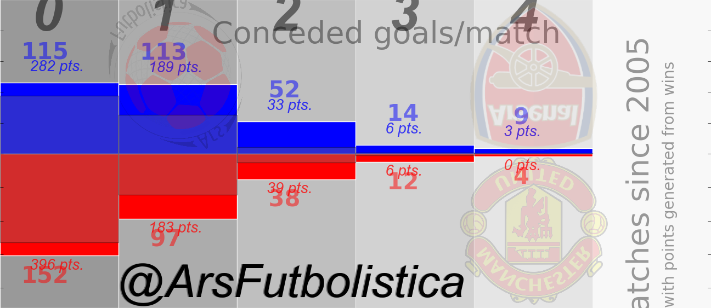

# Kink in the armor

## Arsenal vs. Manchester United

Since Arsenal's historic Invincible season, Arsene Wenger's team has undeniably disappointed their legions of fans winning no major trophy since the FA cup in 2005. Analyzing Arsenal's offensive output in the League since 2004-2005 in comparison to Manchester United, one finds that Arsenal has scored on average only around 3 less goals per season than the Red Devils. However, Manchester United has finished about 12 points ahead of Arsenal on a average, per season basis. Indeed, United has finished as Premier League champion 4 of the 8 seasons since that amazing Arsenal season in 2003-2004.

<table border="1.0" align="center" cellpadding="0" cellspacing="0">
<tr bgcolor="gray">
<td>         Team         </td><td>  Goals For  </td><td>  Goals Against  </td>
<td> Points </td>
</td><td>  Goals For/season  </td><td>  Goals Against/season  </td>
<td> Points/season </td>
</tr>
<tr>
<td>  Arsenal </td><td>          589          </td><td>     303      </td>
<td> 586 </td> 
<td> 73.625 </td> <td> 37.875 </td><td> 73.25 </td>
</tr>
<tr>
<td>  Man United </td><td>  614  </td><td>     231      </td>
<td> 680 </td>
<td>  76.75 </td> <td> 28.875 </td><td> 85.0</td>
</tr>
</table>

## How?

Clearly, this might point to defensive failings rather than offensive ones. However, in an integrated sense there again was not a huge difference, Arsenal received just 8 more goals against per season in this span than Manchester United. Taking all this information into consideration, how can this translate to such a large difference in fortunes? 

A closer look at the distribution of the number of goals conceded per match reveals Arsenal is simply far less efficient in keeping clean sheets. Within this category, Manchester United won 86% of matches to Arsenal's comparable 81%. 
These are the "easier" matches to win, and Manchester United had 37 more chances to do it generating 114 more points than Arsenal.

Therefore, any particular goal United scored was more likely to occur in a game where they did not concede and automatically earning 3 points. This points to an "efficiency" credit to Manchester United's goals that Arsenal lacks. A lot more of Arsenal's goals are scored in games where they have conceded and therefore do not earn them victory as often.

 
